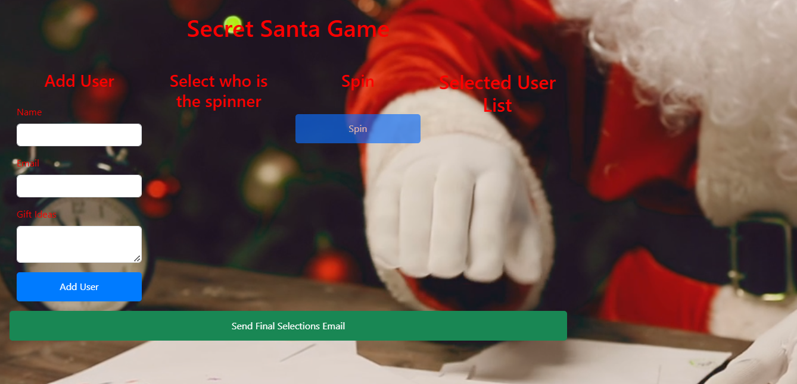
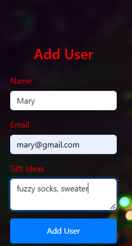
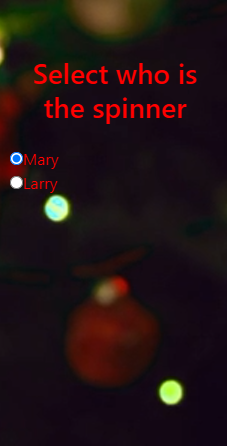
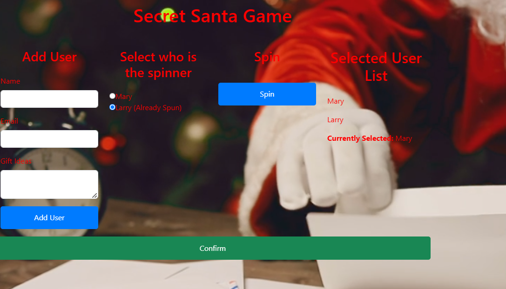

  # Title
  <h1> Secret Santa </h1>
   

  ## Table of Contents

  - [Description](#description)
  - [Design](#design)
  - [Install](#install)
  - [Contributor](#contributor)
  - [License](#license)
  - [Questions](#questions)

  ## Description

   A user will open the page and be presented with a form to add users.  They will add a name, email and gift idea suggested by person entering information. Once all user names are entered you will click the button next to list of users and then click Spin. This will randomly selecte a name from the list. You click Confirm and then an email will be sent to you with the person you selected along with their gift ideas. When all users have taken a turn then you are presented with a Send master list email button, once clicked you are prompted for an admin email, this will send the complete list to that email for reference. 

  ## Design

    To help randomly choose who you are a Secret Santa for. 

 

  ## Install

    npm start run

  ## Contributor

    mvoidets, google searched, chatGPT

  ## License

    This is not licensed  

  ### Questions

  If you have any questions, please contact me at: [mvoidets@yahoo.com] (mailto:mvoidets@yahoo.com). 

  My GitHub profile is [mvoidets](https://github.com/mvoidets/giftslayer).

  Thank you for visiting my repository!